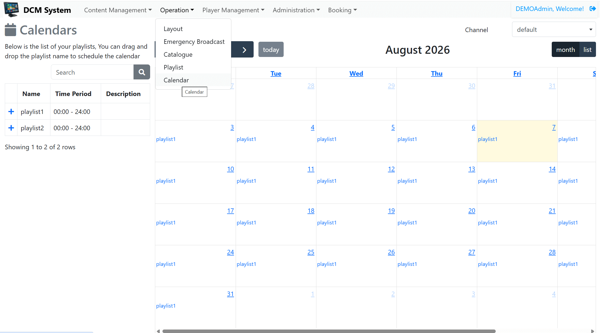
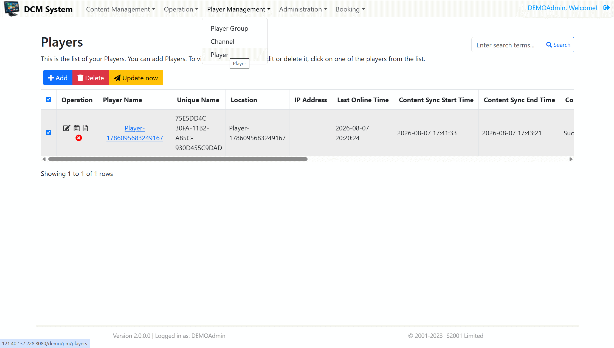

# dcm-flutter

中文 | [English](./README_en.md)

DMC Digital Signage Player

基于 Flutter 和 Dart 构建的跨平台全屏数字标牌与媒体播放解决方案，适用于多区域显示布局场景。系统可将屏幕划分为多个可自定义大小和位置的播放区域，并支持在本地文件与网络资源之间切换播放各类媒体内容。

## 产品概览

本项目是一款面向数字标牌、智能零售展示、信息墙与媒体展示场景的专业多屏播放系统。它支持在单屏或多屏环境下，按区域组合播放多种内容，并实现统一管理与灵活轮播。

### 核心功能

- 支持在全屏模式下播放大屏、墙面显示器或数字标牌内容。
- 支持灵活的多区域布局，可自定义分区数量、区域尺寸与位置。
- 支持播放多种内容类型，包括视频、图片、文本、实时信息、PPT、PDF、HTML、滚动文本以及图片幻灯片。
- 支持多个节目或播放列表在不同区域之间轮播与排程。
- 支持播放本地媒体文件，也支持在线/网络内容。
- 支持系统开机自动启动。
- 可作为单机播放器独立运行，也可与 CMS 服务同步更新，实现远程内容管理与集中控制。
- 支持 Windows、macOS、Linux、Android、iOS 和 Web 等多平台部署。

### 亮点摘要

- 面向数字标牌与信息展示的多区域、多内容播放能力。
- 支持节目轮播与 CMS 同步管理，便于集中更新。
- 基于 Flutter 与 Dart 提供统一的跨平台交付能力。

### 典型应用场景

- 企业前台与接待展示屏
- 零售门店与智能购物场景
- 公共信息墙与交通枢纽终端
- 教育培训与会议演示屏幕
- 通过排程更新内容的远程数字标牌管理

### 平台与技术

本应用采用 Flutter 与 Dart 实现，提供统一的跨平台代码能力，同时支持独立本地播放与 CMS 演示系统 http://121.40.137.228:8080/demo 的同步更新。

[](https://github.com/s2001wincrown/dcm-flutter/actions)
[](https://github.com/s2001wincrown/dcm-flutter/releases)  [](https://github.com/orgs/s2001wincrown/projects/3)


支持平台：Windows、macOS、Linux、Android、iOS 和 Web。

## 平台支持版本

- Flutter SDK：当前值 `>=3.1.3 <4.0.0`（`pubspec.yaml`）；建议使用 Flutter 3.29.0 及以上版本。
- Android：当前值在 `android/app/build.gradle` 中使用 `minSdkVersion flutter.minSdkVersion` 和 `targetSdkVersion flutter.targetSdkVersion`；建议使用与当前 Flutter SDK 兼容的 Android SDK 配置。
- macOS：当前值 `macOS 10.14.6`（`macos/Podfile`）；建议使用 `macOS 10.14.6` 或更高版本。
- Windows：当前支持 Flutter Windows 桌面；建议在 Windows 10/11 平台上构建和运行。
- Linux：当前支持 Flutter Linux 桌面；建议安装 GTK 3 和 `libmpv` 运行时依赖。
- Web：当前支持 Flutter Web 部署；建议使用现代浏览器。

### 详细平台支持

| 平台 | 当前值 | 建议值 |
| --- | --- | --- |
| Android | 当前使用 `android/app/build.gradle` 中的 Flutter 管理值：`minSdkVersion flutter.minSdkVersion` / `targetSdkVersion flutter.targetSdkVersion` | Android 5.0+（API 21+） |
| iOS | 受 Flutter SDK 管理，具体值取决于运行时的 iOS 项目配置 | iOS 9+（建议使用更高版本） |
| macOS | 当前最低 `macOS 10.14.6`（`macos/Podfile`） | macOS 10.14.6+ |
| Windows | 当前支持 Flutter Windows 桌面构建 | Windows 10/11 |
| Linux | 当前支持 Flutter Linux 桌面构建 | 现代 GNU/Linux 发行版，需 GTK 3 和 `libmpv` |
| Web | 当前支持 Flutter Web 部署 | 现代浏览器 |

## 产品界面展示

<table>
  <tr>
    <td>
      
    </td>
    <td>
      
    </td>
  </tr>
  <tr>
    <td>
      
    </td>
    <td>
      
    </td>
  </tr>
</table>

## 应用启动与 CMS 内容同步

1. 从 GitHub Releases 页面下载适用于当前平台的安装包或应用程序：<https://github.com/s2001wincrown/dcm-flutter/releases>。
2. 安装并启动应用。首次启动时，应用界面可能先显示黑屏，这属于正常状态，系统会自动与演示 CMS 系统 http://121.40.137.228:8080/demo 同步内容。
3. 内容同步完成后，应用会自动进入播放状态，开始按照当前节目内容进行展示。
4. 如果需要切换播放内容，请先登录 CMS 演示系统，用户名：`DEMOUser`，密码：`DEMOUser`。
5. 在 Calendar 功能中切换系统预置的 Playlist。
6. 打开 Player 功能，进入 Player 列表（见 `./screenshots/cms2.png`），选择需要更新的 Player，再点击 `Update Now`，将最新内容推送到 Player。
7. Player 接收到更新后会立即切换到新的播放内容。

<table>
  <tr>
    <td>
      
    </td>
    <td>
      
    </td>
  </tr>
</table>

### 使用 Anime4K 着色器

参考 [Anime4K](https://github.com/bloc97/Anime4K) 官方的 GLSL/MPV 安装教程, 下载 template files.

**顶部菜单 -> 应用偏好设置 -> 存储 -> 打开应用数据文件夹**, 把 `mpv.conf`, `input.conf`, `shaders 文件夹` 复制到数据文件夹下.

启用 **应用偏好设置 -> 播放器 -> 允许 libmpv 使用配置文件** 选项, 重启应用.

## 开发说明

如需在本地构建并运行此项目，首先请根据 [官方教程](https://docs.flutter.dev/get-started/install/) 配置 Flutter 环境，并使用不低于 **3.29.0** 的 Flutter 版本。

环境准备完成后，可执行以下命令安装所需依赖：

- `flutter pub get`
- `dart run whisper4dart:setup --prebuilt`

### Windows

在构建 Windows 版本前，先准备 `libmpv` 运行时依赖：

- `dart run libmpv_dart:setup --platform windows`

随后生成 Windows 可执行程序：

- `flutter build windows`

### Linux

配置完 Flutter 后，请通过系统包管理器或其他方式安装 `libmpv-dev`。

生成 Linux 可执行程序：

- `flutter build linux`

### macOS

生成 macOS 可执行程序：

- `flutter build macos`

### Android

> 请在平板设备上运行。

生成 APK 安装包：

- `flutter build apk`

## 发布说明

本项目支持根据 git tag 自动同步 `pubspec.yaml` 中的版本号，并通过脚本一键执行构建与发布。

### 版本同步方式

在仓库根目录执行：

```bash
git fetch --tags origin
python tools/sync_version_from_git_tag.py
```

脚本会按优先级读取最新 tag：

1. `git describe --tags --abbrev=0`
2. 本地最新 tag
3. 远端最新 tag
4. 若没有 tag，则保持现有版本不变

并会自动去掉 `v` 前缀，例如：

- `v1.0.1` -> `1.0.1`

### 本地发布脚本

在 Windows PowerShell 中执行：

```powershell
./tools/release.ps1 -Target windows
```

可选参数：

```powershell
./tools/release.ps1 -Target all
./tools/release.ps1 -Target linux -SkipBuild
./tools/release.ps1 -Target windows -GenerateNotes
./tools/release.ps1 -Target windows -AutoCommit -AutoTag
./tools/release.ps1 -Target windows -AutoCommit -AutoTag -AutoPush
./tools/release.ps1 -Target windows -AutoCommit -AutoTag -AutoPush -PublishGithub -GithubToken YOUR_GH_TOKEN
```

脚本会自动完成：

- 拉取远端 tag
- 同步版本到 `pubspec.yaml`
- 可选提交 `pubspec.yaml` 变更
- 可选创建并推送 git tag
- 生成 release notes
- 构建指定平台的产物
- 可选上传到 GitHub Release

### 完整发布工作流

如果你希望一键完成“版本同步 + 提交 + tag + 推送 + 发布”，可以直接运行：

```powershell
./tools/release.ps1 -Target windows -AutoCommit -AutoTag -AutoPush -PublishGithub -GithubToken YOUR_GH_TOKEN
```

它会做这些事：

1. 拉取最新远端 tag
2. 使用 git tag 更新 `pubspec.yaml` 版本
3. `git add pubspec.yaml`
4. `git commit -m "chore: sync version to X.Y.Z"`
5. 创建 tag，例如 `v1.0.1`
6. `git push origin HEAD`
7. `git push origin --tags`
8. 构建产物并上传到 GitHub Release

### 直接上传到 GitHub Release

如果已安装 GitHub CLI，并设置了 `GH_TOKEN`，可直接执行：

```powershell
$env:GH_TOKEN = 'YOUR_GITHUB_TOKEN'
./tools/release.ps1 -Target windows -PublishGithub
```

或者在命令行中传入：

```powershell
./tools/release.ps1 -Target windows -PublishGithub -GithubToken YOUR_GITHUB_TOKEN
```

> 若网络异常或远端拉取 tags 失败，脚本会保留本地 tag，并继续后续流程，不会因为网络问题中断发布。

## 参与贡献

欢迎参与本项目的建设。如果您在使用过程中发现问题、希望反馈缺陷或提出功能建议，请 [新建一个 issue](https://github.com/s2001wincrown/dcm-flutter/issues/new)。

我们也非常欢迎通过 Pull Request 提交代码改进、平台适配与新功能支持。

## Star History

[](https://star-history.com/#s2001wincrown/dcm-flutter&Date)
