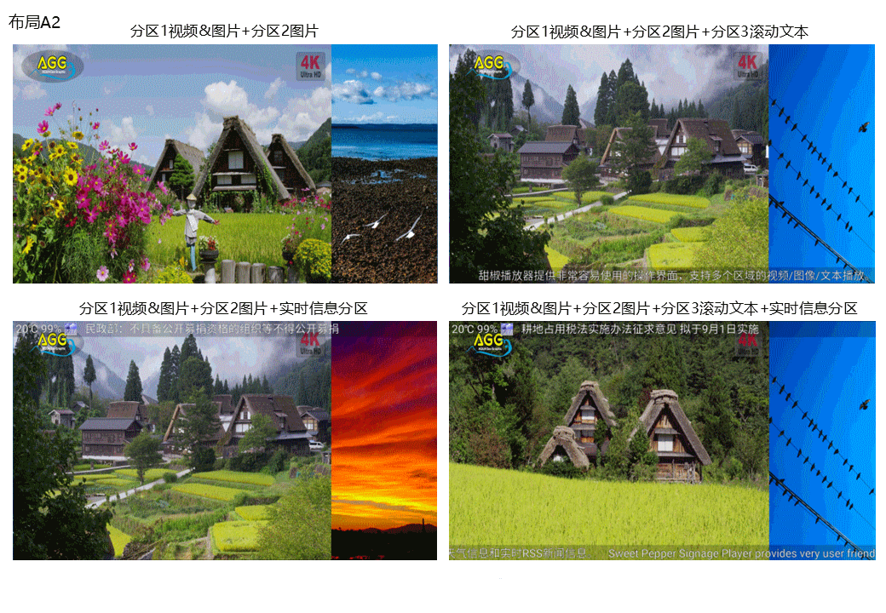
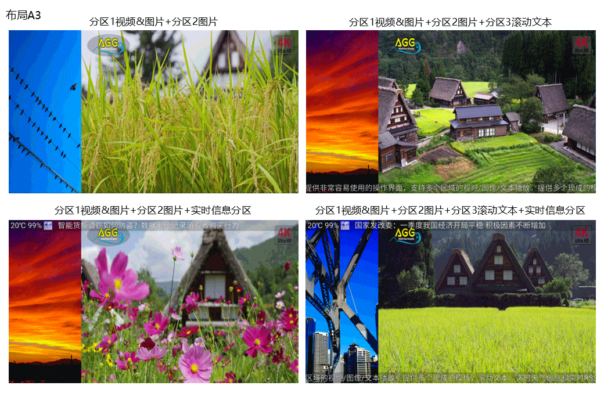
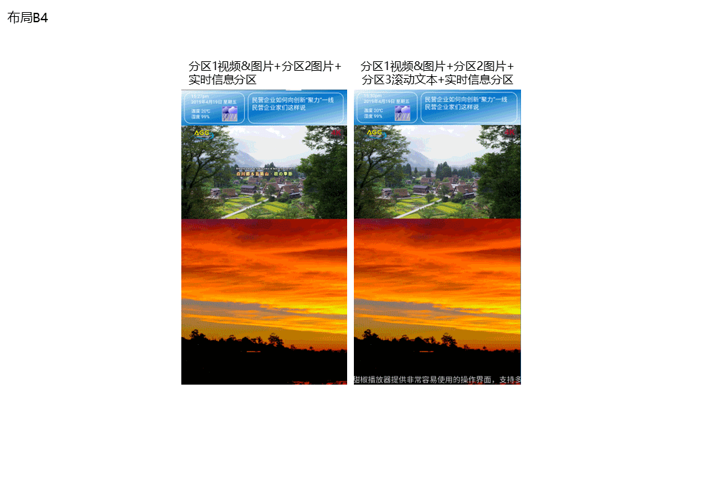

# dcm-flutter

[中文](./README.md) | English

A `libmpv` based media player with Material 3 design.

  

## Screenshots

<table>
  <tr>
    <td>
      
    </td>
    <td>
      
    </td>
  </tr>
  <tr>
    <td>
      
    </td>
    <td>
      
    </td>
  </tr>
</table>

## For Developers

First, set up the Flutter environment according to the [official guide](https://docs.flutter.dev/get-started/install/). Please use Flutter version **3.29.0** or higher.

Then run `flutter pub get` and `dart run whisper4dart:setup --prebuilt` to get necessary dependencies.

### Windows

Before building the application, run `libmpv_dart:setup --platform windows` to get libmpv dependencies.

Run `flutter build windows` in the project directory to generate the Windows executable.

### Linux

After setting up Flutter, install `libmpv-dev` via your system package manager or other means.

Run `flutter build linux` in the project directory to generate the Linux executable.

### macOS

Run `flutter build macos` in the project directory to generate the macOS executable.

### Android

> Please run on tablet devices.

Run `flutter build apk` to generate the APK installation file.

## Contributing to This Project

If you find a bug or want to suggest a feature, please [create a new issue](https://github.com/s2001wincrown/dcm-flutter/issues/new).
Pull requests with code contributions are also welcome.

## Star History

